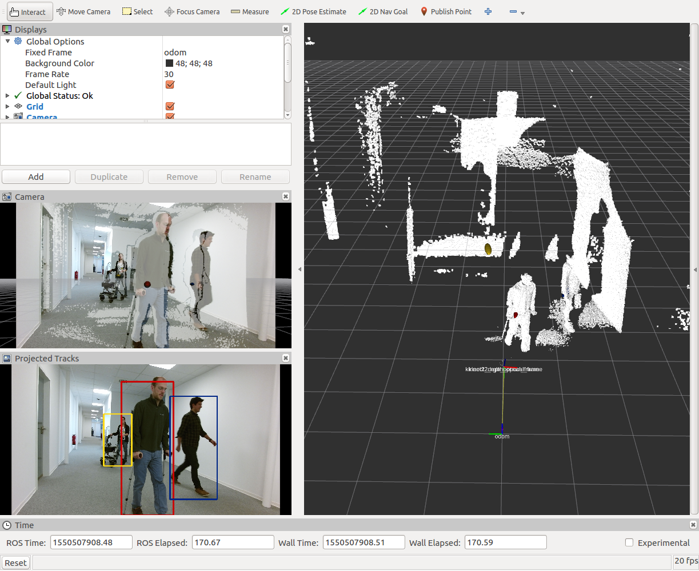

# mobilityaids_detector
ROS node for 3D detection and tracking of people and their mobility aids, using the Faster R-CNN framework. A GPU is required to run the mobilityaids_detector at a sensible rate. 

If you use our mobilityaids_detector, please cite our paper:

```
@article{kollmitz19ras,
  author = {Marina Kollmitz and Andreas Eitel and Andres Vasquez and Wolfram Burgard},
  title = {Deep {3D} perception of people and their mobility aids},
  journal = {Robotics and Autonomous Systems},         
  year = {2019},
  issn = {0921-8890},
  volume = {114},
  pages = {29-40},
  doi = {10.1016/j.robot.2019.01.011},
  url = {http://ais.informatik.uni-freiburg.de/publications/papers/kollmitz19ras.pdf},
}
```

## Setup
1. Mobilityaids Detector Code

   Clone mobilityaids_detector code in your catkin_ws and compile
   ```
   cd ~/catkin_ws/src
   git clone https://github.com/marinaKollmitz/mobilityaids_detector.git
   cd ..
   catkin_make
   ```

2. Multiclass Tracking Code

   Additionally you need the [multiclass-people-tracking](https://github.com/marinaKollmitz/multiclass-people-tracking) code. Clone    it into a directory of your choice which we will refer to as `$TRACKING_ROOT`:
   ```
   cd $TRACKING_ROOT
   git clone https://github.com/marinaKollmitz/multiclass-people-tracking
   ```
   To make sure the mobilityaids_detector can find the tracking code you can add it to your `$PYTHONPATH` by adding the following to your `.bashrc`:
   ```
   export PYTHONPATH=$PYTHONPATH:$TRACKING_ROOT/multiclass-people-tracking/
   ```

3. Detectron Code

   Lastly, you need our adapted Detectron Code for people detection. Please follow the points "Installation" and "Get Trained Mobility Aids Models" from the [Mobilityaids Howto](https://github.com/marinaKollmitz/DetectronDistance/blob/master/MOBILITYAIDS_HOWTO.md).

## Mobilityaids Detector Demo

To run the mobilityaids detection demo, first download the `test_mobilityaids.bag` file:
``` 
wget http://mobility-aids.informatik.uni-freiburg.de/test_mobilityaids.bag
```
Start the mobilityaids_detector ROS node and play the bag file:
``` 
roslaunch mobilityaids_detector detection_RGB.launch model_config:=<PATH_TO_DETECTRONDISTANCE>/mobilityaids_models/VGG-M/faster_rcnn_VGG-M_RGB.yaml 
```
You should see an rviz window coming up and the console output should print "waiting for images". Now play the bag file
```
rosbag play test_mobilityaids.bag
```
You should see tracking visualizations in rviz, like this:
<div align="center">
  
  <p>Mobilityaids Detector Demo</p>
</div>

The demo uses the RGB image stream for people perception, the depth cloud you see in the main rviz window is for reference only. The elliptical markers in the main rviz window visualize the positions and pose uncertainties of the tracks. In the lower left window you see the tracks projected into image space. 

For the DepthJet detection demo, you can run:
``` 
roslaunch mobilityaids_detector detection_DepthJet.launch model_config:=<PATH_TO_DETECTRONDISTANCE>/mobilityaids_models/VGG-M/faster_rcnn_VGG-M_DepthJet.yaml 
rosbag play test_mobilityaids.bag
```
## Tracking Configuration and ROS Parameters

Dynamic Reconfigure can be used to adjust the parameters of the tracking module. Please also refer to our paper for a closer explaination of the parameters.

* `pos_cov_threshold`: position covariance threshold, in [m], before the tracks are deleted. We compare the length of the major axis of the sigma confidence ellipse of the tracking state covariances. 
* `mahalanobis_max_dist`: Mahalanobis distance threshold for pairing detections to tracks [-]
* `euclidean_max_dist`: Euclidean distance threshold for pairing detections to tracks, in [m]
* `accel_noise`: Noise in constant velocity assumption of person, modeled by an acceleration, in [ms^-2].  
(ideally the parameter should work for different filter time frequencies. However, the acceleration noise does not take into account that while people can change their velocity quickly, their final velocity is limited. As a result, if the time step between frames is rather large (compared to the 0.06s we used in our RAS paper), the uncertainty in velocity and position grows large very quickly. Change this parameter if you feel the uncertainty grows large too slowly or quickly) 
* `height_noise`: Noise in constant height assumption of person, in [m]
* `init_vel_sigma`: Initial uncertainty in velocity, in [ms^-1]. The pose uncertainty is initialized from the sensor noise covariance
* `hmm_transition_prob`: Transition probability of the mobilityaids classes of the HMM. How likely it is that the class changes between frames (e.g., person with crutches puts the crutches away and is now a pedestrian)
* `use_hmm`: Whether to use the HMM component of the tracking module. If false, the tracker performs EKF updates and the mobilityaids class is determined by the last paired detection.

## Running the Mobilityaids Detector on Your Robot

For running the mobilityaids_detector on your own data, change the `camera_topic` and `camera_info_topic` accordingly. The tracking also requires tf transformations between the `fixed_frame` and the camera frame (from the `camera_info_topic`). If tf is not available, you can set the `tracking` ros param to false and use the detection only.  
